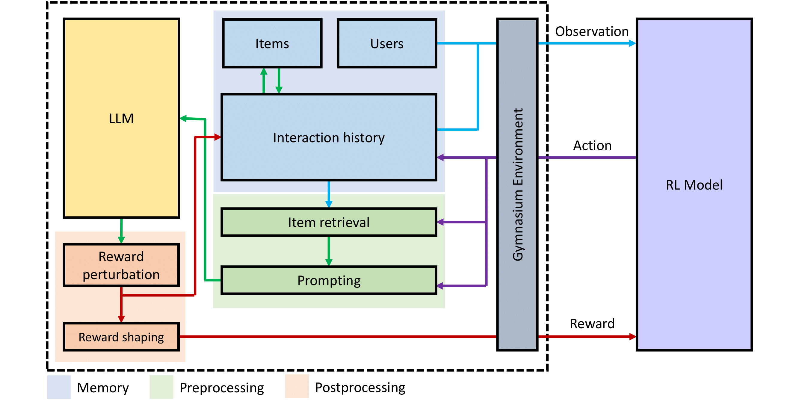

# SUBER: Simulated User Behavior Environment for Recommender systems



<p align="left"> 

</p>

This repository accompanies our research paper titled "**An LLM-based Recommender System Environment**".

#### Our paper:

"**[An LLM-based Recommender System Environment](http://arxiv.org/abs/2406.01631)**" by *Nathan Coreco\*, Giorgio Piatti\*, Luca A. Lanzendörfer, Flint Xiaofeng Fan, Roger Wattenhofer*.

**Citation:**
```bibTeX
@misc{corecco2024llmbased,
      title={An LLM-based Recommender System Environment}, 
      author={Nathan Corecco and Giorgio Piatti and Luca A. Lanzendörfer and Flint Xiaofeng Fan and Roger Wattenhofer},
      year={2024},
      eprint={2406.01631},
      archivePrefix={arXiv},
      primaryClass={cs.IR}
}
```

We open source `SUBER`, a Reinforcement Learning (RL) environment for recommender systems.
We adopt the standard of [Farama's Gymnasium](https://gymnasium.farama.org/) and are compatible with  [Stable Baselines3](https://stable-baselines3.readthedocs.io/en/master/). `SUBER` is a framework for simulating user behavior in recommender systems, for which we provide a set of recommendation environments: movies, and books.

Along with `SUBER`, we provide instructions on how to run the code.

## Guide

### Requirements

Python 3.9 and CUDA 11.8 with PyTorch 2. Run [setup.sh](setup.sh) for a quick setup using conda, or see [requirements.txt](requirements.txt) for the full list of Python packages.

We only tested the code on Linux. We suggest to use a virtual conda environment to install the required packages.


### General environment arguments
The following arguments are available for all environments, and can be passed to ablations and RL training:

```
--llm-model: LLM model to use for the environment. We support Llama based models via exllama GPTQ and OpenAI GPT-3.5 and GPT-4.
--llm-rater: Prompting strategy to query the LLM
--items-retrieval: Items retrieval strategy
--perturbator: Reward perturbator strategy 
--reward-shaping: Reward shaping strategy
--user-dataset: Dataset of users to use
```


### Run ablations
Run the following command to run a config of ablations for the movie environment:
``` 
python3 -m ablations.movies.run <args>
```

Run the following command to run a config of ablations for the book environment:
```
python3 -m ablations.books.run  <args>
```

### Run RL training
Run the following command to run the RL training for the movie environment:
```
python3 -m algorithms.movies.CF_train_A2C
```
Additional arguments are available, see `algorithms/movies/CF_train_A2C.py` file for more details.


## Developer Notes
We provide two main recommendation environments: movies and books. Each environment has its own folder in the `environment` folder.
Each environment has its own `configs.py` file, which contains the default configuration and arguments for the environment. 

### Implementing a new environment
To implement a new environment, you need to create a new folder in the `environment` folder, and implement the following classes:
- `Item`: extends the `Item` class in `items.py`
- `User`: extends the `User` class in `users.py`
- `Rater`: extends the `Rater` class in `rater.py`
- `Loader`: extends the `Loader` class in `loader.py`
and the following files:
- `configs.py`: default configuration and arguments for the environment

We refer to the `movies` and `books` environments for examples.

### Project structure

```
ablations/
    movies/
        datasets/                   -- Ablation datasets
        reports/                    -- Results folder (output)
        src/                        -- Source files for the ablatiosn test cases
        run.py                      -- Run Book ablations (*)
        run_gpt.py                  -- Run Book ablations - less sampling (*)
        run_sampling_analysis.sh    -- Run sampling analysis for all reports folders
    movies/
        datasets/                   -- Ablation datasets
        reports/                    -- Results folder  (output)
        src/                        -- Source files for the ablatiosn test cases
        run.py                      -- Run Movie ablations (*)
        run_gpt.py                  -- Run Movie ablations - less sampling (*)
        run_sampling_analysis.sh    -- Run sampling analysis for all reports folders

algorithms/                         -- RL train code
    movies/                         -- RL trainining and analysis code
    wrappers.py                     -- Gymnasium wrappers to use Stable Baselines-3
environment/
    LLM/                            -- LLM model specific subfolders
        guidance/                   -- Guidance model class, used for user generator
        exllama.py                  -- ExLLAMA model class (for GPTQ inference)
        llm.py                      -- Abstract LLM model class, used by the rater
        rater.py                    -- Rater class (base class), used to rate items based on user characteristics and items features, 
                                       all prompting strategy need to extend this class
    books/                          -- Book specific environment components
        datasets/                   -- TMDB data saved in JSON format
        rater_prompts/              -- Rater prompts for movies environment
        users_generator/            -- Users generator for movies environment
        book.py                     -- Book class for features
        book_loader.py              -- Load movies from CSV dataset to Book class
        configs.py                  -- Default configuration and arguments for the movie environment
    
    movies/                         -- Movie specific environment components
        datasets/                   -- TMDB data saved in JSON format
        rater_prompts/              -- Rater prompts for movies environment
        users_generator/            -- Users generator for movies environment
        movie.py                    -- Movie class for features
        movies_loader.py            -- Load movies from JSON dataset to Movie class
        configs.py                  -- Default configuration and arguments for the movie environment
    users/                          -- 
        datasets/                   -- Dataset sampling during users generation
        user.py                     -- User class
        user_loader.py              -- UserLoaders support CSV and list of User objects
    env.py                          -- Gymnasium environment
    items.py                        -- Abstract class for item, all environment need to extend this class
    memory.py                       -- Memory for each user containing item_id and rating for past interacions
    items_perturbation.py           -- Perturbation components
    items_retrival.py               -- Retrieval components
    reward_perturbator.py           -- Reward perturbation components
    reward_shaping.py               -- Reward shaping components   
```

## License

The `SUBER` code is released under the CC BY 4.0 license. For more information, see [LICENSE](LICENSE).
